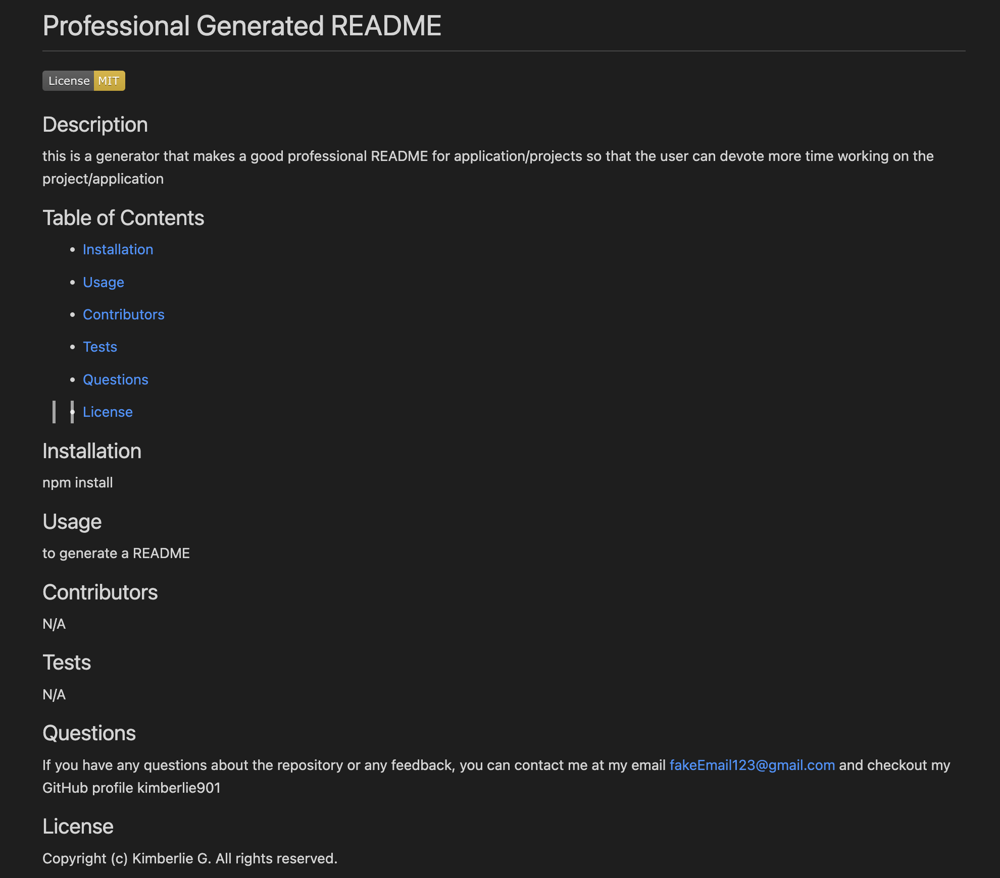

# Professional README Generator

## Description

This is a Visual Studio Code command-line application that uses Node.js to generate a professional README.md file from the user's input for applications and projects so that the user can devote more time working on the application/project.

## Installation

- Visual Studio Code 
- Download or clone respository 
- Node.js 
- npm install to install the required npm packages 

## Usage

- The user will open Visual Studio Code 
- In the terminal the application will be invoked by using node index.js
- The user will then be prompted to answer questions 
- From the questions that the user had input the information will be used to generate the README file.
- The user can now use the professional generated README for their application or project. 

[Video Demo](https://drive.google.com/file/d/1PZKLgMzCZ8jAzMPBc08LfZkhBXvXfird/view?usp=sharing)

[Deployed Application](https://kimberlie901.github.io/WhatYouDoInALibrary/)

## Technologies

- Visual Studio Code
- JavaScript
- Node.js
- npm 
- ShieldsIO (for badges)

## License 

Please refer to the LICENSE in the repo.
Copyright (c) Kimberlie Guillaume. All rights reserved. 